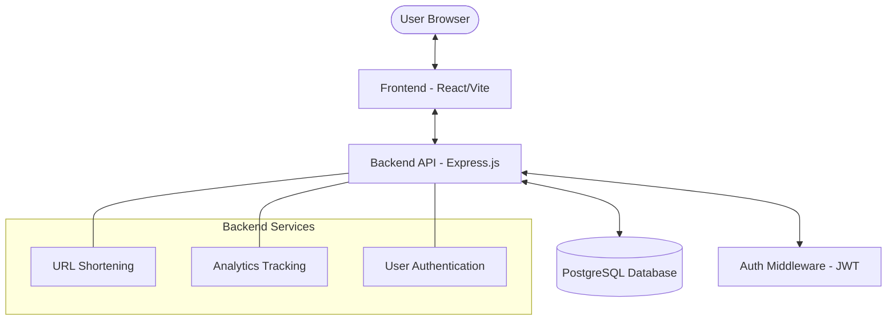

# 🚀 URL Shortener & Analytics Platform

A modern, full-stack URL shortening service built with **React**, **Node.js**, and **PostgreSQL**. This platform provides secure URL shortening, custom aliases, and detailed real-time analytics for every link.

---

## 🏗️ Architecture



---

## ✨ Features

-   **Shorten URLs**: Quickly generate short, shareable links.
-   **Custom Aliases**: Create easy-to-remember custom URLs (e.g., `link.com/my-portfolio`).
-   **Link Expiration**: Set expiration dates for links (optional).
-   **Comprehensive Analytics**:
    -   Total click counts.
    -   Geographic data (Click by country).
    -   Device & Browser tracking.
-   **User Dashboard**: Manage your links, see stats, and delete old URLs.
-   **Secure Authentication**: JWT-based login and registration.
-   **Rate Limiting**: Protection against brute-force and spam.
-   **Docker Ready**: Fully containerized for easy deployment.

---

## 🛠️ Tech Stack

### Frontend
-   **Framework**: React 18
-   **Styling**: Vanilla CSS (Modern Aesthetics)
-   **State Management**: Context API
-   **Routing**: React Router
-   **Charts**: Analytics visualization via custom components.

### Backend
-   **Runtime**: Node.js
-   **Framework**: Express.js
-   **Database**: PostgreSQL
-   **Auth**: JSON Web Tokens (JWT) & bcrypt
-   **Middlewares**: CORS, Express Rate Limit, User Agent Parser.

### Infrastructure
-   **Containerization**: Docker & Docker Compose
-   **Production Proxy**: Nginx (configured for frontend)

---

## 📂 Project Structure

```text
├── backend/
│   ├── src/
│   │   ├── config/         # Database and app configuration
│   │   ├── controllers/    # Request handlers (logic)
│   │   ├── middleware/     # Auth and validation guards
│   │   ├── models/         # SQL schemas and migration files
│   │   ├── routes/         # Express API endpoints
│   │   └── utils/          # Helper functions (code generation, parsing)
│   └── Dockerfile          # Backend container config
├── frontend/
│   ├── src/
│   │   ├── api/            # API service calls
│   │   ├── components/     # Reusable UI components
│   │   ├── context/        # Global state (Auth)
│   │   ├── pages/          # Main application views
│   │   └── index.css       # Core design system
│   └── Dockerfile          # Frontend container config
└── docker-compose.yml      # Service orchestration
```

---

## 🚀 Getting Started

### Prerequisites
-   [Docker Desktop](https://www.docker.com/products/docker-desktop/) installed.
-   Node.js (Optional, if running outside Docker).

### Running with Docker (Recommended)

1.  **Clone the repository**:
    ```bash
    git clone https://github.com/10KRITESH/url-shortner.git
    cd url-shortner
    ```

2.  **Setup Environment Variables**:
    Create a `.env` file in the root directory:
    ```env
    POSTGRES_DB=url_shortener
    POSTGRES_USER=postgres
    POSTGRES_PASSWORD=your_password
    JWT_SECRET=your_super_secret_key
    ```

3.  **Start the services**:
    ```bash
    docker-compose up --build
    ```

4.  **Access the application**:
    -   Frontend: `http://localhost:3000`
    -   Backend API: `http://localhost:5000`

---

## 🔒 Security

-   **Password Hashing**: Bcrypt is used for secure password storage.
-   **Protected Routes**: Sensitive API actions require a valid JWT bearer token.
-   **Standard Headers**: Rate limiting and CORS are configured to protect against common web vulnerabilities.

## 📈 Database Schema

The system uses three primary tables:
1.  `users`: Stores user credentials and profile info.
2.  `urls`: Stores original URLs, short codes, and associations.
3.  `clicks`: Stores analytics data for every redirection.

---


---

Developed by [Your Name/Handle]

