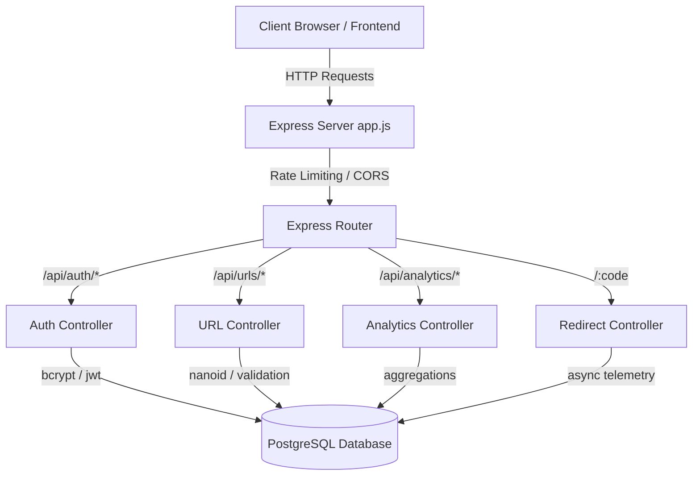
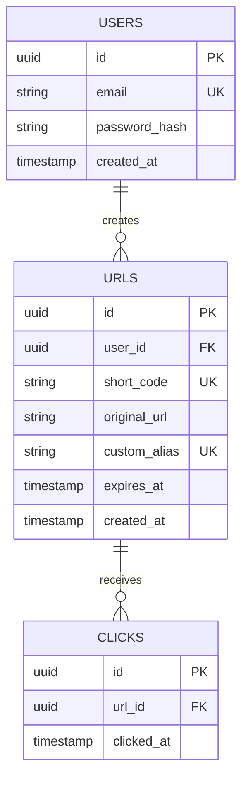
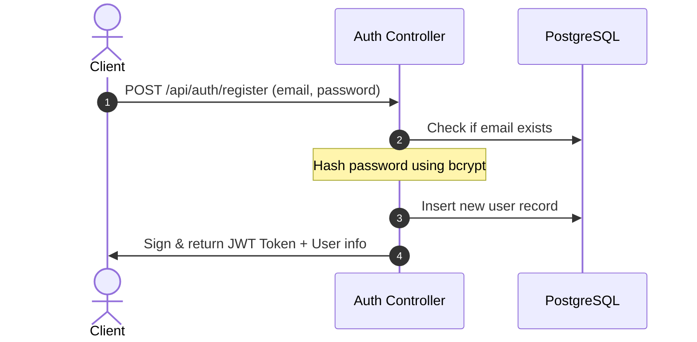
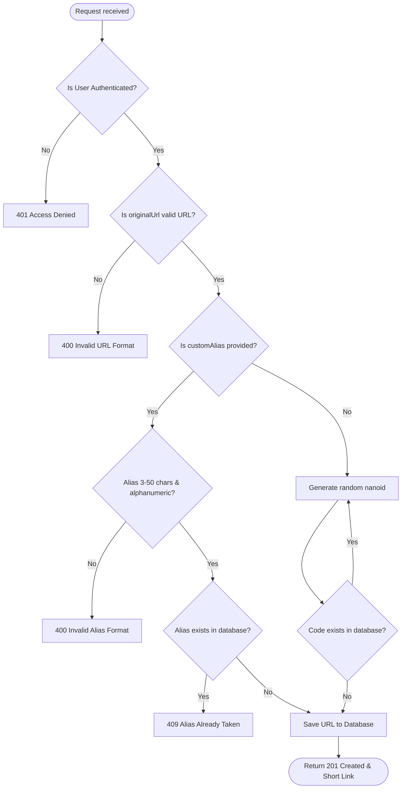
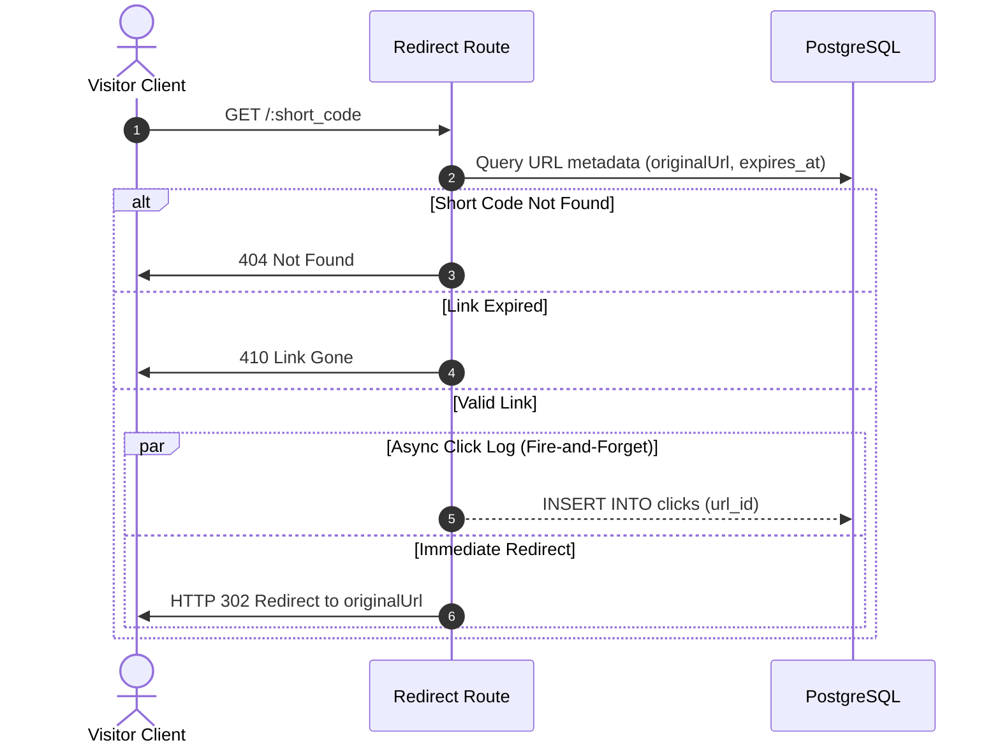

# 🚀 URL Shortener Backend: Architectural Overview & Guide

Welcome to the backend architecture guide! This backend is a high-performance **URL Shortener API** built using **Node.js (Express)**, **PostgreSQL** for storage, and **JSON Web Tokens (JWT)** for secure, stateless authentication. It features rate-limiting, custom alias creation, expiration dates, and real-time 30-day click analytics.

---

## 🏗️ Core Architecture & Tech Stack



### Key Libraries & Tech
*   **Express**: Lightweight web framework for handling routing, middleware, and request/response lifecycles.
*   **PostgreSQL (`pg` pool)**: Relational database storing users, URLs, and redirect clicks.
*   **JWT (`jsonwebtoken`)**: Stateless user authentication.
*   **bcryptjs**: Safe, slow hashing algorithm for storing user passwords securely.
*   **nanoid**: Generates short, URL-safe random string identifiers.
*   **express-rate-limit**: Safeguards endpoints (e.g., maximum 100 requests per 15 minutes per IP).

---

## 🗄️ Database Design (`schema.sql`)

The database consists of three relational tables optimized with indexes:



*   [schema.sql](file:///home/kriteshgoud/Documents/NMIMS/projects/url_shortener/backend/src/models/schema.sql) defines:
    *   **`users`**: Manages credentials.
    *   **`urls`**: Associates shortened links with users. Supports expiration (`expires_at`) and custom URL slugs (`custom_alias`).
    *   **`clicks`**: Telemetry records tracking every click redirect timestamp.
    *   **Performance Indexes**: Indexes are placed on `short_code`, `custom_alias`, `user_id`, `url_id`, and `clicked_at` to ensure fast redirect lookups and timeline aggregations.

---

## 🚦 Request & Data Flows

### 1. User Authentication Flow



*   **Registration** ([auth.controller.js:L5-52](file:///home/kriteshgoud/Documents/NMIMS/projects/url_shortener/backend/src/controllers/auth.controller.js#L5-52)): Checks password criteria, hashes the password via `bcrypt.hash` (10 rounds), saves it, signs a 7-day token, and returns it.
*   **Login** ([auth.controller.js:L54-93](file:///home/kriteshgoud/Documents/NMIMS/projects/url_shortener/backend/src/controllers/auth.controller.js#L54-93)): Fetches the database user, performs `bcrypt.compare` to verify credentials, and issues a 7-day JWT.
*   **Access Control Middleware** ([auth.middleware.js](file:///home/kriteshgoud/Documents/NMIMS/projects/url_shortener/backend/src/middleware/auth.middleware.js)): Inspects the HTTP request `Authorization: Bearer <token>` header, decodes user credentials, and puts it in `req.user`.

---

### 2. URL Shortening Flow

When creating a short URL via `POST /api/urls/shorten`:



*   **Controller code**: Check out `shortenUrl` in [url.controller.js:L7-80](file:///home/kriteshgoud/Documents/NMIMS/projects/url_shortener/backend/src/controllers/url.controller.js#L7-80).
*   **Link format**: Formatted short links default to `BASE_URL` or dynamically fallback to standard request protocol/host details.

---

### 3. Redirection & Async Click Logging Flow

The redirection route `GET /:code` is critical. It must be blazing fast so that visitors redirect immediately. Therefore, click tracking is handled asynchronously.



*   **Redirection Mechanism** ([url.controller.js:L127-160](file:///home/kriteshgoud/Documents/NMIMS/projects/url_shortener/backend/src/controllers/url.controller.js#L127-160)):
    1.  Validates and fetches short link info. If expired (`expires_at` is in the past), returns a `410 Gone` status code.
    2.  Fires an async database insert query into `clicks` without awaiting (`.catch(err => ...)` prevents unhandled errors), and immediately sends an HTTP `302 Redirect` back to the visitor.

---

### 4. Analytics Visualization Endpoints

The backend exposes an analytical endpoint for the user dashboard, verified by authentication:

*   **Overview Analytics** `GET /api/analytics/:code` ([analytics.controller.js](file:///home/kriteshgoud/Documents/NMIMS/projects/url_shortener/backend/src/controllers/analytics.controller.js)):
    *   Returns URL configuration metadata.
    *   Provides total click count (`COUNT(*)` on `clicks` for that `url_id`).
    *   Performs grouped query for traffic logs over the **last 30 days** (`GROUP BY DATE(clicked_at)`) to display timeline trends on the frontend.

---

## 🛠️ File Structure Reference

Here is a map of the backend directories:

```
backend/
├── package.json                # Project script dependencies
├── src/
│   ├── app.js                  # Express Entry point & main middleware stack
│   ├── config/
│   │   └── db.js               # Database Pool initialization & error listeners
│   ├── controllers/
│   │   ├── analytics.controller.js   # Grouped SQL queries for URL usage telemetry
│   │   ├── auth.controller.js        # User signup/signin & token authentication
│   │   └── url.controller.js         # Core shortening, redirection, and validation
│   ├── middleware/
│   │   └── auth.middleware.js        # JWT header validation middleware
│   ├── models/
│   │   └── schema.sql                # SQL definition for tables and indexing
│   ├── routes/
│   │   ├── analytics.routes.js       # Router registration for analytics charts
│   │   ├── auth.routes.js            # Router registration for register & login
│   │   └── url.routes.js             # Router registration for shortening actions
│   └── utils/
│       └── generateCode.js     # Helper function mapping to nanoid code generator
```

---

> [!TIP]
> **Performance Optimization**: 
> Notice how `redirectUrl` does not `await` the PostgreSQL log insertion block! It executes `pool.query('INSERT INTO clicks (url_id)...')` in the background and issues `res.redirect(302, ...)` right away. This speeds up redirects dramatically, keeping response latency under 10ms.
